# Project Scout: Retail Insights Dashboard Philippines 🇵🇭

<div align="center">


**A comprehensive AI-powered retail analytics platform for consumer insights, competitive analysis, and market intelligence across Philippine retail markets.**

[🚀 Live Demo](https://retail-insights-dashboard-ph-jakes-projects-e9f46c30.vercel.app) • [📊 Dashboard](https://supabase.com/dashboard/project/lcoxtanyckjzyxxcsjzz) • [📖 Documentation](./docs/)

</div>

---

## 🏗️ Architecture Overview

```mermaid
graph TB
    %% Data Sources
    subgraph "Data Sources"
        A[🏪 POS Systems]
        B[📱 Mobile Apps]
        C[🎯 IoT Edge Devices]
        D[📋 Survey Data]
        E[🔍 Social Media APIs]
    end

    %% Edge Computing Layer
    subgraph "Edge Computing Layer"
        F[🔧 Raspberry Pi 5 Devices]
        G[🧠 Local NLP Processing]
        H[📊 Real-time Analytics]
        I[💾 Local Cache]
    end

    %% ETL Pipeline
    subgraph "ETL Pipeline"
        J[🔄 Data Ingestion]
        K[🧹 Data Cleaning]
        L[🔀 Data Transformation]
        M[📈 Analytics Processing]
        N[🏷️ AI/ML Enrichment]
    end

    %% Core Database
    subgraph "Supabase Backend"
        O[(🗃️ PostgreSQL)]
        P[🔐 Row Level Security]
        Q[⚡ Real-time Subscriptions]
        R[🔑 Authentication]
    end

    %% Analytics & AI
    subgraph "Analytics & AI Engine"
        S[📊 Behavioral Analytics]
        T[🎯 Market Segmentation]
        U[🔮 Predictive Models]
        V[💬 NLP Sentiment Analysis]
        W[🛒 Recommendation Engine]
    end

    %% Frontend Applications
    subgraph "Frontend Applications"
        X[💻 Executive Dashboard]
        Y[📱 Mobile Analytics]
        Z[📊 Store Manager Portal]
        AA[👥 Customer Insights]
    end

    %% External Integrations
    subgraph "External Integrations"
        BB[☁️ Azure OpenAI]
        CC[📧 Email Notifications]
        DD[📱 SMS Alerts]
        EE[📈 Power BI Export]
    end

    %% Data Flow
    A --> J
    B --> J
    C --> F
    D --> J
    E --> J

    F --> G
    F --> H
    F --> I

    G --> J
    H --> J
    I --> J

    J --> K
    K --> L
    L --> M
    M --> N
    N --> O

    O --> P
    O --> Q
    O --> R

    P --> S
    Q --> T
    R --> U
    S --> V
    T --> W

    U --> X
    V --> Y
    W --> Z
    S --> AA

    X --> BB
    Y --> CC
    Z --> DD
    AA --> EE

    %% Styling
    classDef dataSource fill:#e1f5fe,stroke:#01579b,stroke-width:2px
    classDef edge fill:#f3e5f5,stroke:#4a148c,stroke-width:2px
    classDef etl fill:#e8f5e8,stroke:#1b5e20,stroke-width:2px
    classDef database fill:#fff3e0,stroke:#e65100,stroke-width:2px
    classDef analytics fill:#fce4ec,stroke:#880e4f,stroke-width:2px
    classDef frontend fill:#e0f2f1,stroke:#004d40,stroke-width:2px
    classDef external fill:#f1f8e9,stroke:#33691e,stroke-width:2px

    class A,B,C,D,E dataSource
    class F,G,H,I edge
    class J,K,L,M,N etl
    class O,P,Q,R database
    class S,T,U,V,W analytics
    class X,Y,Z,AA frontend
    class BB,CC,DD,EE external
```



## 🌟 Key Features

### 🎯 **Real-time Analytics**

- Live sales tracking and KPI monitoring
- Customer behavior analysis
- Market trend identification
- Competitive intelligence

### 🤖 **AI-Powered Insights**

- Natural Language Processing for sentiment analysis
- Predictive analytics for demand forecasting
- Customer segmentation with machine learning
- Automated report generation

### 🔧 **Edge Computing**

- Raspberry Pi 5 devices for local data processing
- Offline capability with data synchronization
- Local NLP models for privacy-first processing
- Real-time product detection and classification

### 📊 **Comprehensive Dashboards**

- Executive-level business intelligence
- Store manager operational insights
- Customer journey analytics
- Brand performance tracking

---

## 🚀 Quick Start

### Prerequisites

- Node.js 18+
- npm or yarn
- Supabase account
- (Optional) Raspberry Pi 5 for edge deployment

### 1. **Clone & Setup**

```bash
git clone https://github.com/tbwa-smp/project-scout.git
cd project-scout
npm install
```

### 2. **Environment Configuration**

```bash
# Copy environment template
cp .env.example .env.local

# Configure your Supabase credentials
VITE_SUPABASE_URL=https://lcoxtanyckjzyxxcsjzz.supabase.co
VITE_SUPABASE_ANON_KEY=your-anon-key
VITE_SUPABASE_SERVICE_ROLE_KEY=your-service-role-key
```

### 3. **Database Setup**

```bash
# Run database migrations
npm run migrate

# Seed with sample data (optional)
npm run seed
```

### 4. **Development**

```bash
# Start development server
npm run dev

# Build for production
npm run build

# Preview production build
npm run preview
```

---

## 🗄️ Database Schema

### Core Tables

#### **Brands** - Brand master data

```sql
CREATE TABLE brands (
    id BIGSERIAL PRIMARY KEY,
    name TEXT NOT NULL,
    is_tbwa BOOLEAN DEFAULT false,
    category TEXT,
    created_at TIMESTAMPTZ DEFAULT NOW()
);
```

#### **Products** - Product catalog

```sql
CREATE TABLE products (
    id BIGSERIAL PRIMARY KEY,
    name TEXT NOT NULL,
    brand_id BIGINT REFERENCES brands(id),
    price NUMERIC(10,2),
    category TEXT,
    created_at TIMESTAMPTZ DEFAULT NOW()
);
```

#### **Transactions** - Sales transactions

```sql
CREATE TABLE transactions (
    id BIGSERIAL PRIMARY KEY,
    total_amount NUMERIC(10,2) NOT NULL,
    customer_age INTEGER,
    customer_gender TEXT CHECK (customer_gender IN ('Male', 'Female', 'Other')),
    store_location TEXT,
    device_id TEXT,
    created_at TIMESTAMPTZ DEFAULT NOW()
);
```

### Edge Device Tables

#### **Devices** - IoT device registry

```sql
CREATE TABLE devices (
    id UUID DEFAULT gen_random_uuid() PRIMARY KEY,
    device_id TEXT UNIQUE NOT NULL,
    device_type TEXT DEFAULT 'RaspberryPi5',
    firmware_version TEXT DEFAULT '2.1.0',
    status TEXT DEFAULT 'active',
    last_seen TIMESTAMPTZ DEFAULT NOW()
);
```

#### **Device Health** - Real-time monitoring

```sql
CREATE TABLE device_health (
    id UUID DEFAULT gen_random_uuid() PRIMARY KEY,
    device_id TEXT NOT NULL,
    cpu_usage DECIMAL(5,2),
    memory_usage DECIMAL(5,2),
    temperature DECIMAL(5,2),
    timestamp TIMESTAMPTZ DEFAULT NOW()
);
```

#### **Product Detections** - AI detection results

```sql
CREATE TABLE product_detections (
    id UUID DEFAULT gen_random_uuid() PRIMARY KEY,
    device_id TEXT NOT NULL,
    brand_detected TEXT NOT NULL,
    confidence_score DECIMAL(5,4),
    customer_age INTEGER,
    customer_gender TEXT,
    detected_at TIMESTAMPTZ DEFAULT NOW()
);
```

---

## 🛠️ Technology Stack

### **Frontend**

- ⚛️ **React 18** with TypeScript
- 🎨 **Tailwind CSS** + shadcn/ui components
- 📊 **Recharts** for data visualization
- ⚡ **Vite** for build tooling
- 🌐 **Vercel** for deployment

### **Backend & Database**

- 🗃️ **Supabase** (PostgreSQL + Real-time)
- 🔐 **Row Level Security** for data protection
- ⚡ **Real-time subscriptions** for live updates
- 🔑 **Built-in authentication** and authorization

### **Edge Computing**

- 🔧 **Raspberry Pi 5** edge devices
- 🐍 **Python 3.11** with asyncio
- 🧠 **Ollama** for local LLM inference
- 📊 **spaCy** for NLP processing
- 🔄 **Real-time synchronization** with cloud

### **AI & Analytics**

- 🤖 **Azure OpenAI** for advanced NLP
- 📈 **Custom analytics engine** in TypeScript
- 🎯 **Machine learning models** for predictions
- 💬 **Sentiment analysis** and classification

---

## 📈 ETL Pipeline

### **Data Ingestion Layer**

```typescript
// Real-time data ingestion from multiple sources
const dataSources = {
  pos: 'Point of Sale systems',
  mobile: 'Mobile applications',
  iot: 'Edge IoT devices',
  surveys: 'Customer feedback',
  social: 'Social media APIs',
};
```

### **Processing Pipeline**

1. **🔄 Data Ingestion** - Multi-source data collection
2. **🧹 Data Cleaning** - Validation and normalization
3. **🔀 Data Transformation** - ETL processing
4. **📈 Analytics Processing** - KPI calculation
5. **🏷️ AI/ML Enrichment** - Sentiment analysis, predictions
6. **💾 Data Storage** - Optimized database storage

### **Real-time Features**

- ⚡ Live dashboard updates
- 🔔 Instant alerts and notifications
- 📊 Real-time KPI monitoring
- 🎯 Dynamic customer segmentation

---

## 🎯 Business Intelligence Features

### **Executive Dashboard**

- 📊 Revenue and sales KPIs
- 📈 Market trend analysis
- 🎯 Brand performance tracking
- 💰 ROI and profitability metrics

### **Operational Analytics**

- 🏪 Store performance comparison
- 📦 Inventory optimization insights
- 👥 Staff performance metrics
- ⏰ Peak hours analysis

### **Customer Insights**

- 🎭 Customer demographic analysis
- 🛒 Purchase behavior patterns
- 💝 Loyalty and retention metrics
- 🗣️ Sentiment analysis from feedback

### **Competitive Intelligence**

- 🥊 Brand vs competitor analysis
- 📊 Market share tracking
- 💰 Price positioning insights
- 🎯 Consumer preference trends

---

## 🔧 Edge Device Deployment

### **Hardware Setup**

```bash
# Raspberry Pi 5 configuration
sudo apt update && sudo apt upgrade -y
sudo apt install python3-pip git curl htop -y

# Install Project Scout edge client
curl -O https://raw.githubusercontent.com/tbwa-smp/project-scout/main/edge_client.py
pip3 install psutil supabase-py python-dotenv
```

### **Local NLP Processing** (Optional)

```bash
# Install Ollama for local LLM inference
curl -fsSL https://ollama.ai/install.sh | sh

# Download lightweight models
ollama pull phi3:mini      # 2.3GB - General purpose
ollama pull llama3.2:1b   # 1.3GB - Ultra lightweight

# Install spaCy for NER
pip3 install spacy
python3 -m spacy download en_core_web_sm
```

---

## 🧪 Testing & Quality Assurance

### **Automated Testing**

```bash
# Run test suite
npm run test

# Integration tests
npm run test:integration

# Edge device tests
node test_edge_integration.cjs
```

### **Performance Monitoring**

- 📊 Real-time performance metrics
- 🚨 Automated alerting system
- 📈 Usage analytics and optimization
- 🔍 Error tracking and debugging

### **Performance Benchmarking**

We utilize a performance benchmarking script (`./run-performance-benchmarks.sh`) to assess key metrics including:

- Lighthouse scores (Performance, Accessibility, Best Practices, SEO)
- Bundle size analysis
- Memory profiling
- Runtime performance metrics

Recent optimizations have been implemented in the **Time Series Dashboard** to significantly improve data processing efficiency and reduce load times for large datasets using batch processing and caching.

---

## 📋 Development Roadmap

### ✅ **Completed (v4.0)**

- Core analytics dashboard
- Real-time data pipeline
- Edge device integration
- AI-powered insights
- Customer behavior analysis
- Brand performance tracking

### 🚧 **In Progress (v4.1)**

- Advanced predictive analytics
- Mobile application
- Enhanced NLP capabilities
- Multi-store management

### 📅 **Planned (v5.0)**

- Voice analytics integration
- Computer vision for product detection
- Advanced recommendation engine
- White-label solutions

---

## 🤝 Contributing

We welcome contributions! Please see our [Contributing Guide](./CONTRIBUTING.md) for details.

### **Development Workflow**

1. Fork the repository
2. Create a feature branch: `git checkout -b feature/amazing-feature`
3. Make your changes and test thoroughly
4. Commit: `git commit -m "feat: add amazing feature"`
5. Push: `git push origin feature/amazing-feature`
6. Create a Pull Request

---

## 📄 Documentation

- 📖 [**API Documentation**](./docs/API.md)
- 🔧 [**Edge Device Deployment**](./docs/EDGE_DEVICE_DEPLOYMENT_GUIDE.md)
- 🛠️ [**Development Setup**](./docs/DEVELOPMENT.md)
- 🚀 [**Deployment Guide**](./docs/DEPLOYMENT.md)
- 🔒 [**Security Guidelines**](./docs/SECURITY.md)

---

## 🏆 Recognition & Achievements

- 🥇 **Best Retail Analytics Platform** - Philippine Tech Awards 2024
- 🚀 **Innovation in Edge Computing** - TBWA Technology Excellence
- 📊 **Outstanding Data Visualization** - Philippine Marketing Analytics Society

---

## 📞 Support & Contact

### **Technical Support**

- 📧 Email: support@projectscout.ph
- 💬 Slack: [#project-scout-support](https://tbwa.slack.com/channels/project-scout-support)
- 📱 Phone: +63-XXX-XXX-XXXX

### **Business Inquiries**

- 📧 Email: business@projectscout.ph
- 🌐 Website: [www.projectscout.ph](https://projectscout.ph)

---

## 📄 License

This project is licensed under the MIT License - see the [LICENSE](LICENSE) file for details.

---

<div align="center">

**Built with ❤️ by the TBWA\\Santiago Mangada Puno Team**

[](https://tbwa.com.ph)
[](https://github.com/tbwa-smp)

_Transforming retail insights through AI-powered analytics_

</div>

## Common Pitfalls and Best Practices

### 1. Data Handling
- Never use mock data in production code
- Always validate data before using it
- Use proper type guards for null/undefined checks
- Format dates using ISO 8601 (`toISOString()`)
- Handle empty arrays and null values gracefully

### 2. Error Handling
- Always use `logger.error()` in catch blocks
- Never leave catch blocks empty
- Provide meaningful error messages
- Handle API errors gracefully
- Log errors with proper context

### 3. Type Safety
- Avoid using `any` type
- Use proper TypeScript types
- Add proper return types to functions
- Use type guards for runtime checks
- Avoid non-null assertions (`!`)

### 4. Performance
- Batch large data requests
- Use proper pagination
- Avoid unnecessary re-renders
- Use proper memoization
- Handle large lists efficiently

### 5. Accessibility
- Always include proper ARIA attributes
- Use semantic HTML elements
- Provide proper alt text for images
- Ensure proper keyboard navigation
- Test with screen readers

### 6. Code Quality
- Follow consistent naming conventions
- Use proper code formatting
- Write meaningful comments
- Keep functions small and focused
- Use proper error boundaries

### 7. Testing
- Write unit tests for critical paths
- Test error scenarios
- Test edge cases
- Use proper test data
- Mock external dependencies

### 8. Security
- Never expose sensitive data
- Use proper authentication
- Validate user input
- Use proper CORS settings
- Follow security best practices

### 9. State Management
- Use proper state management
- Avoid prop drilling
- Use proper context
- Handle loading states
- Handle error states

### 10. API Integration
- Use proper error handling
- Use proper data validation
- Use proper type definitions
- Handle rate limiting
- Handle timeouts

## Development Workflow

1. **Before Starting**
   - Read the requirements carefully
   - Plan the implementation
   - Consider edge cases
   - Consider performance implications

2. **During Development**
   - Follow the style guide
   - Write tests
   - Handle errors properly
   - Use proper types
   - Document your code

3. **Before Committing**
   - Run tests
   - Run linter
   - Check for common issues
   - Review your changes
   - Update documentation

4. **After Deployment**
   - Monitor for errors
   - Monitor performance
   - Monitor user feedback
   - Update documentation
   - Plan improvements
