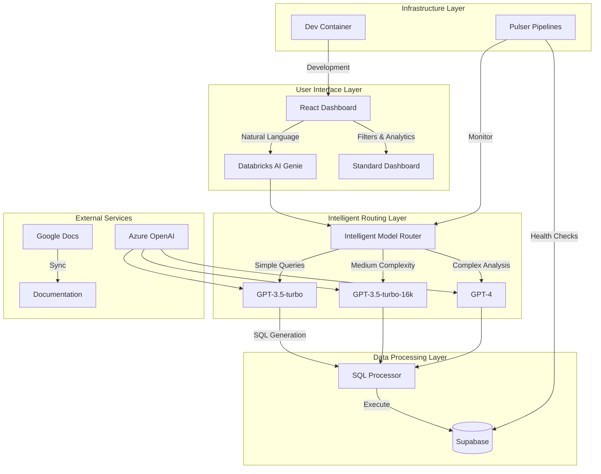

# Retail Insights AI Platform - Architecture Overview

## 🏗️ High-Level Architecture



## 🧠 Intelligent Model Routing

### Core Concept

The platform uses **complexity-based model routing** to optimize cost and performance:

- **Simple queries** → GPT-3.5-turbo (fast, cheap)
- **Medium complexity** → GPT-3.5-turbo-16k (more context)
- **Complex analysis** → GPT-4 (most powerful)

### Pattern Recognition

#### Simple Patterns (GPT-3.5-turbo - ~$0.0005/1K tokens)

```regex
"show top 5 brands"           # Direct aggregation
"what is the total sales"     # Basic calculation
"count customers"             # Simple count
"sum revenue"                 # Basic math
```

#### Complex Patterns (GPT-4 - ~$0.03/1K tokens)

```regex
"analyze customer behavior trends"     # Analysis
"explain why TBWA brands perform"      # Reasoning
"predict future sales patterns"       # Prediction
"compare regional performance"         # Comparison
```

### Cost Optimization

- **60-80% cost reduction** vs always using GPT-4
- **Real-time cost tracking** in UI
- **Automatic fallback** mechanisms
- **Performance monitoring** via Pulser pipelines

## 🗄️ Data Architecture

### Database Schema (Azure PostgreSQL)

```sql
-- Core retail data tables with tenant isolation
transactions (id, total_amount, customer_age, gender, store_location, created_at, tenant_id)
brands (id, name, is_tbwa, category, tenant_id)
products (id, name, brand_id, price, category, tenant_id)
customers (id, age, gender, location, tenant_id)
stores (id, name, location, region, tenant_id)

-- Row Level Security (RLS) policies for multi-tenant access
CREATE POLICY tenant_isolation ON transactions USING (tenant_id = current_setting('app.current_tenant_id'));

-- Secure SQL execution functions
execute_sql(sql_query text) RETURNS TABLE(result json)
execute_sql_simple(sql_query text) RETURNS JSONB
```

### Multi-Tenant Data Flow

1. **User Query** → Natural language in chat interface
2. **Tenant Context** → Extract tenant_id from request headers/auth
3. **Complexity Analysis** → Pattern matching + heuristics
4. **Model Selection** → Route to appropriate GPT model
5. **SQL Generation** → Convert to executable SQL
6. **Data Execution** → Run against Azure PostgreSQL with RLS
7. **Result Processing** → Format + visualize tenant-scoped data
8. **Response** → Natural language explanation + charts

## 🚀 Deployment Architecture

### Development Environment (.devcontainer)

```json
{
  "name": "Retail Insights AI Platform",
  "image": "mcr.microsoft.com/devcontainers/typescript-node:20-bullseye",
  "features": {
    "azure-cli": "Latest Azure tools",
    "python": "3.11 for data processing",
    "docker-in-docker": "Container orchestration"
  }
}
```

### Production Stack

- **Frontend**: React + Vite + Tailwind CSS
- **Backend**: Azure PostgreSQL + Vercel Serverless Functions
- **AI Layer**: Azure OpenAI with intelligent routing
- **Hosting**: Vercel (full-stack deployment)
- **Multi-tenancy**: Row Level Security (RLS) policies
- **Monitoring**: Pulser pipelines + cost tracking

## 🔄 Pulser Pipeline Integration

### Retail AI Genie Pipeline (`retail_ai_genie.yaml`)

```yaml
schedule: '0 */6 * * *' # Every 6 hours

steps:
  - health_check: 'Test Azure OpenAI + Azure PostgreSQL connectivity'
  - test_routing: 'Verify intelligent model selection'
  - sql_generation: 'Test natural language → SQL conversion'
  - tenant_isolation: 'Verify RLS policies work correctly'
  - cost_optimization: 'Generate cost savings report'
  - dashboard_integration: 'Verify UI functionality'
```

### Monitoring & Alerting

- **Cost threshold**: Alert if pipeline costs > $5
- **Performance**: Alert if response time > 5 minutes
- **Error tracking**: Automatic fallback logging
- **Usage analytics**: Model selection patterns

## 🛠️ Development Workflow

### Task Management (Taskfile.yml)

```yaml
tasks:
  doctor: 'Full environment smoke test'
  dev: 'Start development servers'
  build: 'Build all components'
  test: 'Run test suites'
  genie:test: 'Test Databricks AI Genie'
  routing:test: 'Test intelligent routing'
```

### Testing Strategy

```
tests/
├── unit/                    # Component tests
├── integration/             # API integration tests
├── agents/                  # AI agent behavior tests
└── e2e/                     # End-to-end scenarios
```

## 🔐 Security & Configuration

### Environment Variables

```bash
# Azure OpenAI (Required)
AZURE_OPENAI_ENDPOINT=https://your-resource.openai.azure.com/
AZURE_OPENAI_API_KEY=your_api_key
AZURE_OPENAI_API_VERSION=2024-02-15-preview

# Azure PostgreSQL (Required)
AZURE_POSTGRES_HOST=your-server.postgres.database.azure.com
AZURE_POSTGRES_PORT=5432
AZURE_POSTGRES_DATABASE=retail_insights
AZURE_POSTGRES_USERNAME=your_username@your-server
AZURE_POSTGRES_PASSWORD=your_password
AZURE_POSTGRES_SSL=true

# Optional: Advanced features
IOT_DEVICE_API_KEY=your_device_api_key
SLACK_WEBHOOK_URL=your_slack_webhook
```

### Security Features

- **RLS (Row Level Security)** on all Azure PostgreSQL tables
- **Multi-tenant isolation** via tenant_id policies
- **SQL injection protection** via parameterized queries
- **API key rotation** support
- **Secure connection** with SSL/TLS encryption
- **Audit logging** for all AI model calls

## 📊 Performance Optimization

### Intelligent Caching

- **Query result caching** for repeated patterns
- **Model response caching** for similar queries
- **Database query optimization** with materialized views

### Cost Management

- **Real-time cost tracking** per query
- **Budget alerts** at pipeline level
- **Usage analytics** dashboard
- **Model efficiency reports**

## 🔗 Integration Points

### AI Assistants Integration

- **Google Docs** → Documentation sync via middleware
- **Claude/ChatGPT** → Edit docs through shared interface
- **Cursor** → Direct code editing with version control
- **MCP Bridge** → Real-time AI agent communication

### External APIs

- **Azure OpenAI** → Core language model provider
- **Supabase** → Database and real-time subscriptions
- **Vercel** → Frontend hosting and edge functions
- **GitHub** → Source control and CI/CD

## 🎯 Key Decisions & Trade-offs

### Decision: Single LLM Provider (Azure OpenAI)

**Rationale**: Avoid vendor lock-in complexity while maintaining cost optimization
**Trade-off**: Less provider diversity vs simplified authentication and billing

### Decision: Complexity-Based Routing

**Rationale**: 60-80% cost savings vs always using GPT-4
**Trade-off**: Pattern matching complexity vs cost efficiency

### Decision: Supabase for Backend

**Rationale**: PostgreSQL compatibility + real-time features + managed infrastructure
**Trade-off**: Vendor dependency vs development velocity

### Decision: React + Vite Frontend

**Rationale**: Modern development experience + fast builds + rich ecosystem
**Trade-off**: Framework complexity vs developer productivity

## 🔮 Future Roadmap

### Phase 1: Foundation (Current)

- ✅ Intelligent model routing
- ✅ Databricks AI Genie implementation
- ✅ Cost optimization framework
- ✅ Basic monitoring pipeline

### Phase 2: Enhancement (Next)

- 🔲 Advanced pattern recognition
- 🔲 Multi-tenant support
- 🔲 Custom model fine-tuning
- 🔲 Real-time collaboration features

### Phase 3: Scale (Future)

- 🔲 Multi-region deployment
- 🔲 Advanced analytics workbench
- 🔲 ML model marketplace
- 🔲 Enterprise security features

---

**Last Updated**: December 2024  
**Version**: 1.2.0  
**Maintainers**: AI-Agency Team
