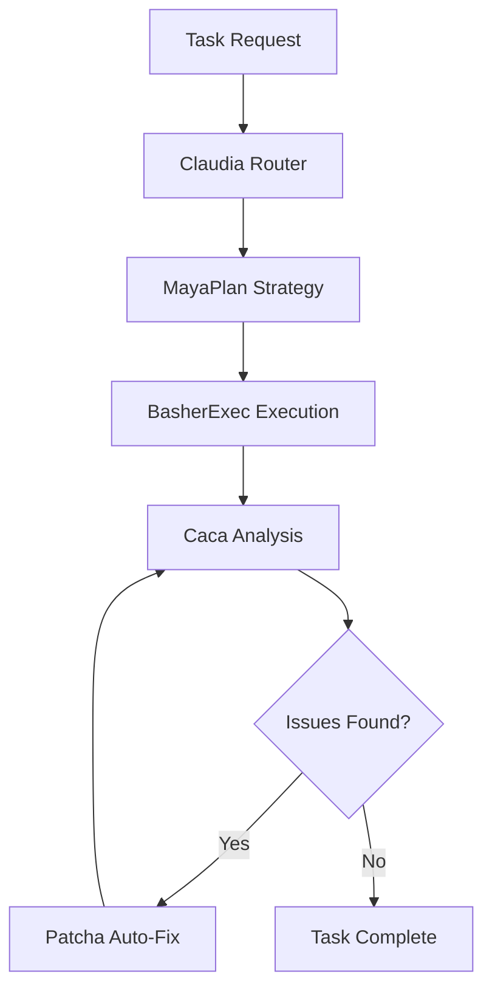

# Pulser Deployment Platform - Standard Operating Procedures

## Overview

Pulser is our first-class build & release platform that provides intelligent agent-based task automation, self-healing pipelines, and standardized deployment workflows across all projects.

## Table of Contents

1. [Core Concepts](#core-concepts)
2. [Project Setup](#project-setup)
3. [Agent Configuration](#agent-configuration)
4. [Standard Workflows](#standard-workflows)
5. [CI/CD Integration](#cicd-integration)
6. [Quality Gates](#quality-gates)
7. [Version Management](#version-management)
8. [Troubleshooting](#troubleshooting)

## Core Concepts

### Pulser Agents

Pulser uses five core agents for comprehensive project management:

- **BasherExec**: Command execution and system operations
- **Caca**: Code analysis, linting, and issue detection
- **MayaPlan**: Strategic planning and task orchestration
- **Claudia**: Smart routing and decision making
- **Patcha**: Self-healing pipeline automation

### Agent Interaction Flow



## Project Setup

### 1. Initial Pulser Integration

Create the following files in your project root:

**pulser.yaml**

```yaml
# Pulser Configuration
version: '2.1.0'
name: '{{ PROJECT_NAME }}'
description: '{{ PROJECT_DESCRIPTION }}'

# Agent Definitions
agents:
  BasherExec: pulser_agents/basher_exec.yaml
  Caca: pulser_agents/caca.yaml
  MayaPlan: pulser_agents/maya_plan.yaml
  Claudia: pulser_agents/claudia.yaml
  Patcha: pulser_agents/patcha.yaml

# Task Scripts with Self-Healing
tasks:
  install:
    description: 'Install project dependencies'
    command: 'npm install'
    retry: true
    max_retries: 3
    self_heal: true

  build:
    description: 'Build the project'
    command: 'npm run build'
    retry: true
    max_retries: 2
    self_heal: true
    dependencies: ['install']

  test:
    description: 'Run all tests'
    command: 'npm test'
    retry: true
    max_retries: 2
    self_heal: true
    dependencies: ['install']

  lint:
    description: 'Run linting and formatting'
    command: 'npm run lint && npm run format'
    retry: true
    max_retries: 3
    self_heal: true
    dependencies: ['install']

  deploy:
    description: 'Deploy the application'
    command: 'npm run deploy'
    retry: false
    dependencies: ['build', 'test', 'lint']

# Environment Configuration
environments:
  development:
    auto_fix: true
    self_heal: true
    strict_mode: false

  staging:
    auto_fix: true
    self_heal: true
    strict_mode: true

  production:
    auto_fix: false
    self_heal: false
    strict_mode: true
    manual_approval: true

# Quality Gates
quality_gates:
  code_coverage: 80
  lint_score: 9.0
  security_scan: true
  performance_budget: true
```

### 2. Directory Structure

```
project-root/
├── pulser.yaml
├── pulser_agents/
│   ├── basher_exec.yaml
│   ├── caca.yaml
│   ├── maya_plan.yaml
│   ├── claudia.yaml
│   └── patcha.yaml
├── .qa/
│   ├── acceptance-template.md
│   └── quality-gates.yml
└── .github/
    └── workflows/
        └── pulser-pipeline.yml
```

## Agent Configuration

### BasherExec Agent

```yaml
# pulser_agents/basher_exec.yaml
agent: BasherExec
description: 'Command execution and system operations'
capabilities:
  - Execute shell commands safely
  - Manage file system operations
  - Handle environment setup
  - Process automation
safety_rules:
  - Never execute commands with sudo unless explicitly required
  - Validate all file paths before operations
  - Log all command executions
  - Timeout long-running processes
```

### Caca Agent

```yaml
# pulser_agents/caca.yaml
agent: Caca
description: 'Code analysis and quality assurance'
capabilities:
  - Static code analysis
  - Lint rule enforcement
  - Security vulnerability scanning
  - Performance optimization suggestions
analysis_tools:
  - eslint
  - prettier
  - typescript-compiler
  - security-scanner
fix_patterns:
  - Auto-format code style issues
  - Fix import ordering
  - Resolve type errors
  - Update deprecated APIs
```

### MayaPlan Agent

```yaml
# pulser_agents/maya_plan.yaml
agent: MayaPlan
description: 'Strategic planning and task orchestration'
capabilities:
  - Task dependency analysis
  - Resource allocation planning
  - Timeline optimization
  - Risk assessment
planning_strategies:
  - Parallel execution when possible
  - Critical path analysis
  - Resource conflict resolution
  - Rollback planning
```

### Claudia Agent

```yaml
# pulser_agents/claudia.yaml
agent: Claudia
description: 'Smart routing and decision making'
capabilities:
  - Intelligent task routing
  - Context-aware decisions
  - Agent coordination
  - Workflow optimization
routing_rules:
  - Route based on task complexity
  - Consider agent availability
  - Optimize for execution time
  - Handle error scenarios
```

### Patcha Agent

```yaml
# pulser_agents/patcha.yaml
agent: Patcha
description: 'Self-healing pipeline automation'
capabilities:
  - Automatic issue resolution
  - Configuration healing
  - Dependency management
  - System recovery
safety_rules:
  - Never modify production data
  - Always create backups before fixes
  - Limit scope of automatic changes
  - Require approval for critical fixes
healing_patterns:
  - Package dependency conflicts
  - Configuration file errors
  - Build process failures
  - Test environment issues
```

## Standard Workflows

### Development Workflow

1. **Feature Development**

   ```bash
   pulser invoke MayaPlan create-feature-branch
   pulser invoke BasherExec setup-development
   pulser invoke Caca analyze-baseline
   ```

2. **Code Quality Check**

   ```bash
   pulser invoke Caca full-analysis
   pulser invoke Patcha auto-fix-issues
   pulser invoke BasherExec run-tests
   ```

3. **Pre-commit Validation**
   ```bash
   pulser invoke Claudia validate-commit
   pulser invoke MayaPlan dependency-check
   pulser invoke Caca security-scan
   ```

### Release Workflow

1. **Version Preparation**

   ```bash
   pulser invoke MayaPlan plan-release
   pulser invoke BasherExec update-version
   pulser invoke Caca changelog-generation
   ```

2. **Quality Assurance**

   ```bash
   pulser invoke Claudia full-qa-suite
   pulser invoke BasherExec integration-tests
   pulser invoke Caca performance-audit
   ```

3. **Deployment**
   ```bash
   pulser invoke MayaPlan deploy-strategy
   pulser invoke BasherExec deploy-staging
   pulser invoke Claudia validate-deployment
   pulser invoke BasherExec deploy-production
   ```

## CI/CD Integration

### GitHub Actions Template

```yaml
# .github/workflows/pulser-pipeline.yml
name: Pulser CI/CD Pipeline

on:
  push:
    branches: [main, develop]
  pull_request:
    branches: [main]

jobs:
  pulser-analysis:
    runs-on: ubuntu-latest
    steps:
      - uses: actions/checkout@v4

      - name: Setup Pulser
        run: |
          npm install -g pulser-cli
          pulser init

      - name: Code Analysis
        run: pulser invoke Caca full-analysis

      - name: Auto-fix Issues
        run: pulser invoke Patcha auto-fix-safe

      - name: Run Tests
        run: pulser invoke BasherExec test-suite

      - name: Build Application
        run: pulser invoke BasherExec build-production

  pulser-deployment:
    needs: pulser-analysis
    if: github.ref == 'refs/heads/main'
    runs-on: ubuntu-latest
    steps:
      - name: Deploy to Staging
        run: pulser invoke MayaPlan deploy-staging

      - name: Validate Deployment
        run: pulser invoke Claudia validate-staging

      - name: Deploy to Production
        if: success()
        run: pulser invoke BasherExec deploy-production
```

## Quality Gates

### Automated Quality Checks

```yaml
# .qa/quality-gates.yml
quality_gates:
  code_quality:
    eslint_score: >= 9.0
    typescript_errors: 0
    test_coverage: >= 80%

  security:
    vulnerability_scan: pass
    dependency_audit: pass
    secrets_scan: pass

  performance:
    build_time: <= 5min
    bundle_size: <= 2MB
    lighthouse_score: >= 90

  compliance:
    license_check: pass
    docs_updated: true
    changelog_updated: true
```

### Manual Review Checklist

```markdown
# .qa/acceptance-template.md

## Pre-Release Checklist

### Code Quality

- [ ] All Pulser agents report green status
- [ ] Code coverage meets threshold (80%+)
- [ ] No critical security vulnerabilities
- [ ] Performance budgets met

### Functional Testing

- [ ] Core features work as expected
- [ ] Edge cases handled properly
- [ ] User experience validated
- [ ] Accessibility requirements met

### Documentation

- [ ] README updated
- [ ] API documentation current
- [ ] Deployment guide accurate
- [ ] Pulser configuration documented

### Deployment Readiness

- [ ] Database migrations tested
- [ ] Environment variables configured
- [ ] Monitoring and alerting setup
- [ ] Rollback plan prepared
```

## Version Management

### Semantic Versioning with Pulser

1. **Automatic Version Bumping**

   ```bash
   pulser invoke MayaPlan analyze-changes
   pulser invoke BasherExec bump-version-patch  # or minor/major
   pulser invoke Caca update-changelog
   ```

2. **Git Conflict Resolution**

   ```bash
   pulser invoke Claudia detect-conflicts
   pulser invoke Patcha resolve-merge-conflicts
   pulser invoke BasherExec validate-resolution
   ```

3. **Release Tagging**
   ```bash
   pulser invoke MayaPlan create-release-notes
   pulser invoke BasherExec tag-release
   pulser invoke Claudia publish-release
   ```

### Branch Protection Rules

- **Main Branch**: Requires Pulser pipeline success
- **Develop Branch**: Requires Pulser analysis pass
- **Feature Branches**: Requires Caca code quality check

## Troubleshooting

### Common Issues and Solutions

#### 1. Agent Communication Failures

```bash
# Diagnose issue
pulser status --verbose

# Reset agent connections
pulser invoke Claudia reset-connections

# Verify agent health
pulser invoke MayaPlan health-check
```

#### 2. Self-Healing Pipeline Stuck

```bash
# Check Patcha status
pulser invoke Patcha status

# Manual intervention
pulser invoke Claudia manual-override

# Reset pipeline state
pulser invoke MayaPlan reset-pipeline
```

#### 3. Quality Gate Failures

```bash
# Detailed analysis
pulser invoke Caca detailed-report

# Get fix suggestions
pulser invoke Patcha suggest-fixes

# Apply safe fixes
pulser invoke Patcha auto-fix-safe
```

### Debug Mode

Enable verbose logging for troubleshooting:

```yaml
# pulser.yaml
debug:
  enabled: true
  log_level: 'debug'
  trace_execution: true
  save_artifacts: true
```

## Best Practices

1. **Agent Configuration**

   - Keep agent configurations version controlled
   - Use environment-specific overrides
   - Regularly update agent capabilities

2. **Pipeline Design**

   - Design for idempotency
   - Implement proper error handling
   - Use incremental builds when possible

3. **Security**

   - Never store secrets in Pulser configs
   - Use secure agent communication
   - Audit agent permissions regularly

4. **Monitoring**
   - Track pipeline performance metrics
   - Monitor agent health status
   - Set up alerting for failures

## Support and Resources

- **Documentation**: `/docs/pulser/`
- **Agent Registry**: `https://github.com/company/pulser-agents`
- **Issue Tracking**: Use project's GitHub Issues with `pulser:` label
- **Team Channel**: `#pulser-support`

---

_This SOP is maintained by the Platform Engineering team. Last updated: {{ CURRENT_DATE }}_
