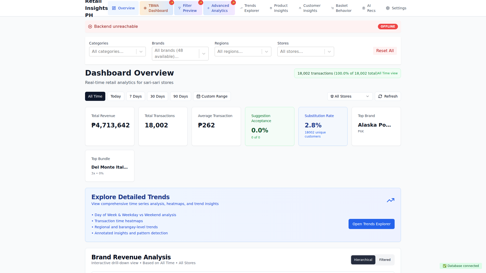
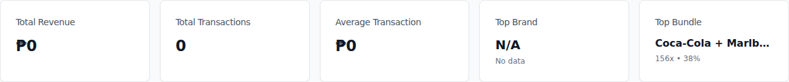
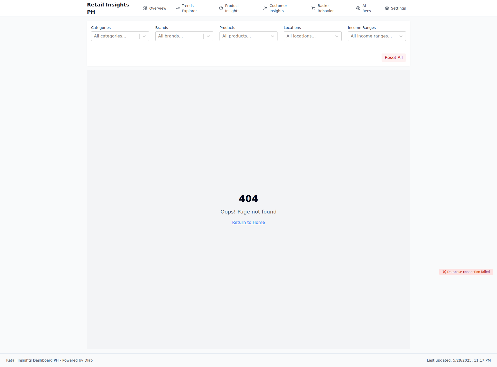

# Visual Documentation

**Generated:** 2025-06-04T16:17:29.963Z
**Commit:** `36774ade51b3c995247a6da733f12ef08470936e`
**Message:** Complete API fixes - all endpoints working

- Added products.category column fix SQL script
- All 7 API endpoints now return 200 OK
- Products category queries no longer return 400 errors
- Database schema fully aligned with frontend expectations

✅ API Status:

- Basic transactions: OK (1 records)
- Products with category: OK (109 records) ← FIXED
- Products basic: OK (1 records)
- Brands with category: OK (89 records)
- Customers basic: OK (1 records)
- Customers regions: OK (5 records)
- Stores: OK (4 records)

🤖 Generated with [Claude Code](https://claude.ai/code)

Co-Authored-By: Claude <noreply@anthropic.com>

## 📱 Screenshots

### Dashboard Overview

Main dashboard with KPIs and transaction trends

Component Details

#### kpi metrics

### Brand Revenue Analysis - Hierarchical View

New hierarchical brand visualization with category drill-down

Component Details

#### kpi metrics

### Brand Revenue Analysis - Filtered View

Smart filtering system with TBWA client highlighting

Component Details

#### kpi metrics

### Product Mix Analysis

Product performance and substitution patterns

---

_Generated by automated visual documentation system_
