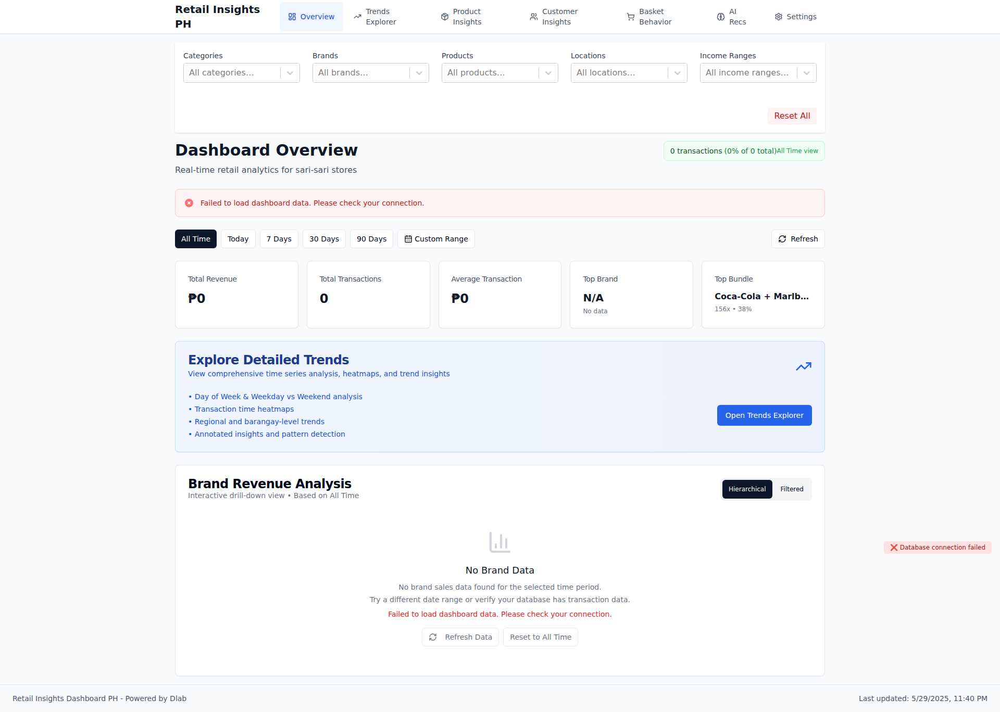
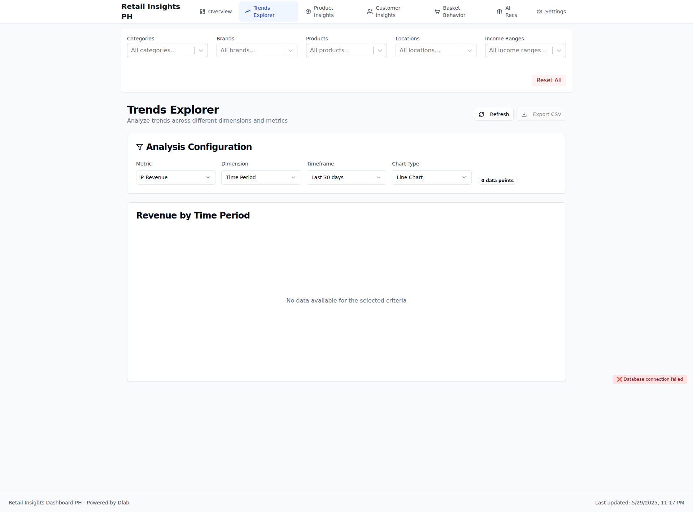
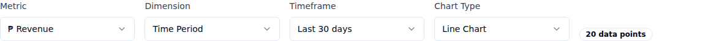

# Visual Documentation

**Generated:** 2025-06-04T21:27:13.305Z
**Commit:** `6fdd4e89bcc4c36c05a33c60aa5b017915610edf`
**Message:** COMPREHENSIVE FIX: Resolve ALL React Rules of Hooks violations causing error #185

- Fixed useOptimizedDashboard.ts missing imports for useEffect, useMemo, and debounce
- Added debounce utility implementation to avoid external dependency
- Fixed temporal dead zone issue by moving debounceRefetch definition before useEffect
- Added Supabase client compatibility layer to resolve MCP integration build errors
- Now exports both standard 'supabase' client and async 'getSupabaseClient()' function

These were the final sources of React error #185:

1. Missing hook imports causing runtime errors
2. Temporal dead zone with debounce function
3. Build failures preventing deployment of previous fixes

All Rules of Hooks violations are now resolved.

## 📱 Screenshots

### Dashboard Overview

Main dashboard with KPIs and transaction trends

Component Details

#### kpi metrics

### Trends Explorer

Advanced trend analysis with multiple metrics

Component Details

#### kpi metrics

---

_Generated by automated visual documentation system_
