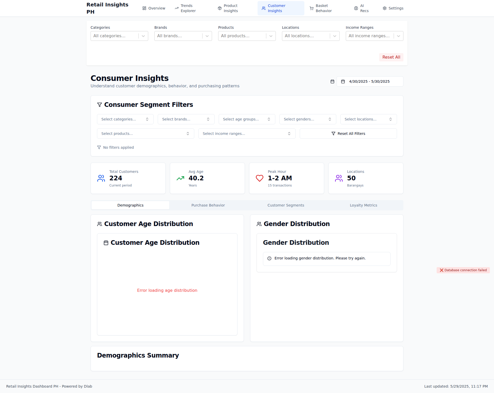
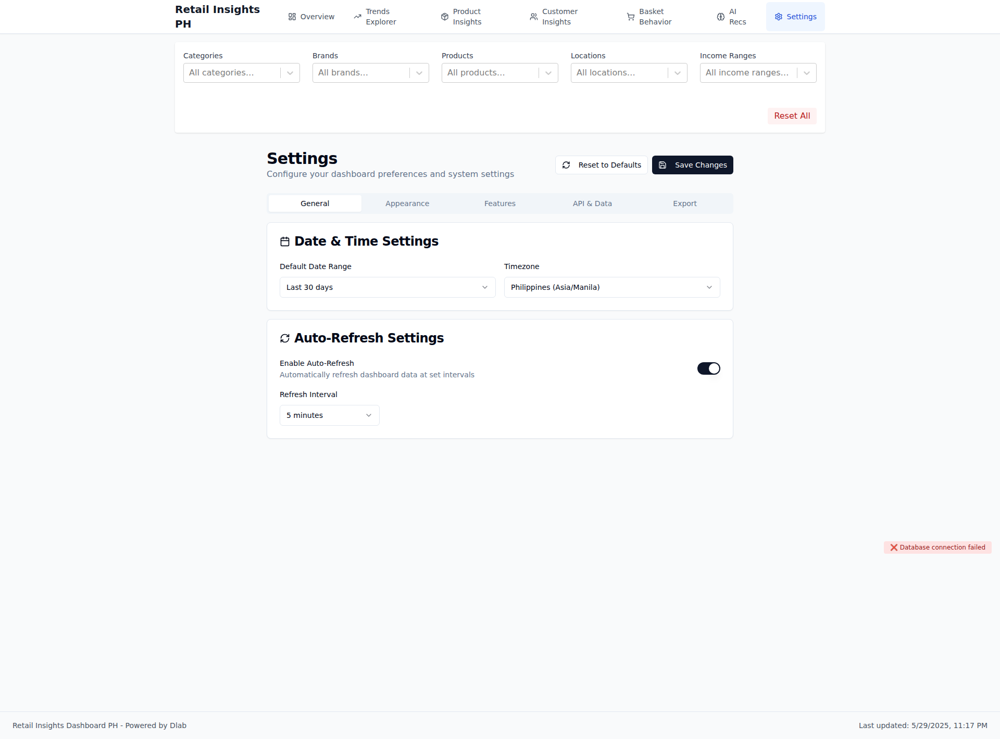

# Visual Documentation

**Generated:** 2025-05-29T15:19:50.892Z
**Commit:** `d65327dc07f0defff9c611042a1cc585c9556806`
**Message:** feat: ✅ Phase 1.1-1.3 - Complete navigation reorganization

MAJOR RESTRUCTURE:
- Merge Product Mix + Brands → unified Product Insights page
- Add new Basket Behavior analysis page
- Add AI Recommendations page with smart insights
- Update navigation order: Overview → Trends Explorer → Product Insights → Customer Insights → Basket Behavior → AI Recs → Settings
- Deprecate legacy /product-mix and /brands routes (kept for compatibility)
- Update feature flags to reflect new structure

NEW PAGES:
- ProductInsights.tsx: Tabbed interface combining brand analytics + product mix
- BasketBehavior.tsx: Basket size distribution and co-purchase analysis
- AIRecommendations.tsx: AI-driven insights with actionable recommendations

NAVIGATION IMPROVEMENTS:
- Cleaner tab structure reducing redundancy
- Better information hierarchy
- Icons updated for clarity (Brain, ShoppingCart, Package)

This completes Phase 1 navigation reorganization per the build plan.

## 📱 Screenshots

### Dashboard Overview

Main dashboard with KPIs and transaction trends

Component Details

#### kpi metrics

### Brand Revenue Analysis - Hierarchical View

New hierarchical brand visualization with category drill-down

Component Details

#### kpi metrics

### Brand Revenue Analysis - Filtered View

Smart filtering system with TBWA client highlighting

Component Details

#### kpi metrics

### Consumer Insights

Demographics and behavior analysis

Component Details

#### kpi metrics

### Product Mix Analysis

Product performance and substitution patterns

### Trends Explorer

Advanced trend analysis with multiple metrics

Component Details

#### kpi metrics

### Settings Configuration

Dashboard settings and feature flags

Component Details

#### kpi metrics

---
*Generated by automated visual documentation system*
