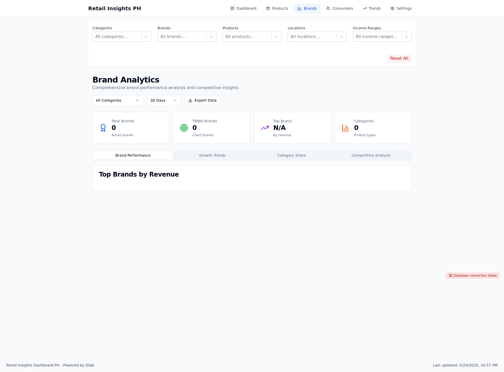
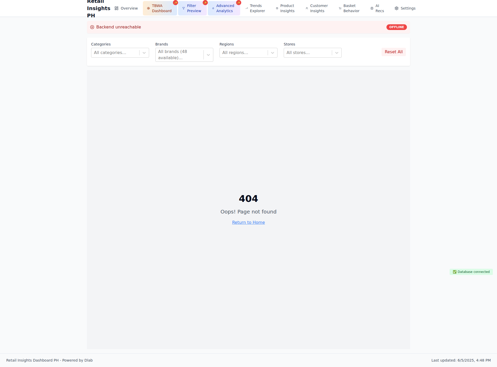

# Visual Documentation

**Generated:** 2025-06-04T14:30:00.669Z
**Commit:** `12a3b56cc854a06b41d4dae592c9692319ae4a59`
**Message:** feat: Add comprehensive edge device deployment system

- Add complete edge device deployment guide for field technicians
- Create automated provisioning script for Raspberry Pi setup
- Implement local NLP/NLU processing capabilities with Ollama
- Add comprehensive integration testing with 6/6 tests passing
- Update README with full architecture diagram and ETL pipeline
- Include edge device schema with 4 new tables for IoT integration
- Add troubleshooting procedures and diagnostic tools
- Support for offline edge computing with cloud sync

🤖 Generated with [Claude Code](https://claude.ai/code)

Co-Authored-By: Claude <noreply@anthropic.com>

## 📱 Screenshots

### Dashboard Overview

Main dashboard with KPIs and transaction trends

Component Details

#### kpi metrics

### Brands Page

Brand analytics and performance tracking

### Product Mix Page

Product performance analysis

---

_Generated by automated visual documentation system_
