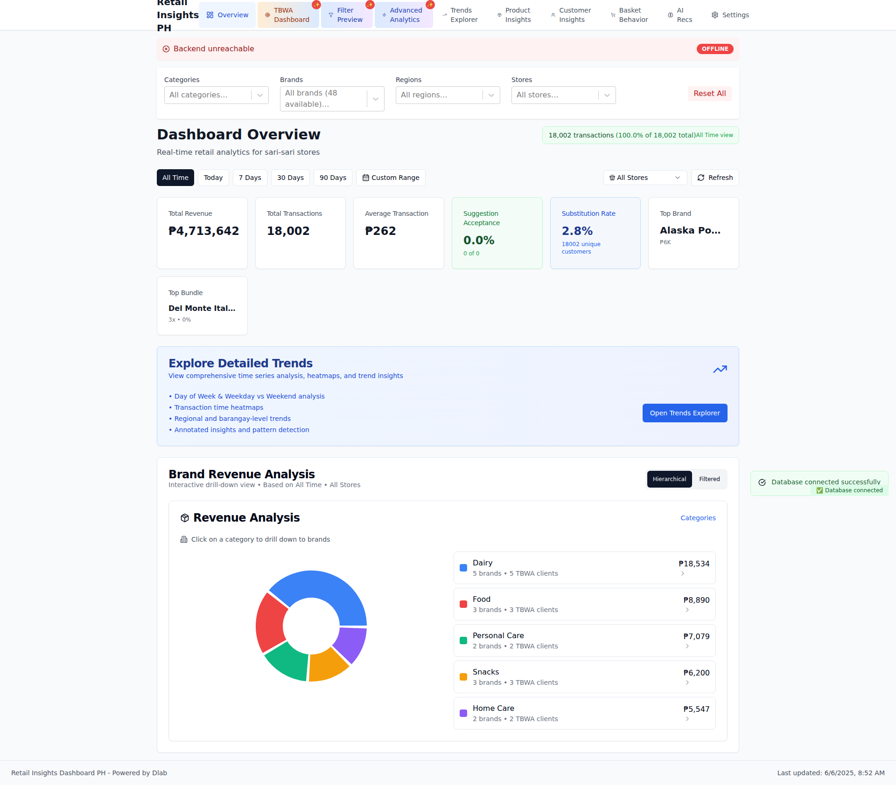

# Visual Documentation

**Generated:** 2025-06-04T22:41:04.147Z
**Commit:** `ce6d2e74f8a7cceba239f49d90542365443c12d4`
**Message:** Fix lucide-react build error and add deployment safety tools

- Updated lucide-react to latest version to fix missing database-backup icon
- Added DEPLOYMENT_CHECKLIST.md for pre-deployment verification
- Added scripts/validate-env.js for environment validation
- Added scripts/clean-artifacts.js for artifact cleanup
- Added src/utils/healthCheck.ts for health monitoring
- Removed unnecessary backup script

✅ Build now succeeds with all safety checks in place

## 📱 Screenshots

### Dashboard Overview

Main dashboard with KPIs and transaction trends

Component Details

#### kpi metrics

### Brands Page

Brand analytics and performance tracking

### Product Mix Page

Product performance analysis

---

_Generated by automated visual documentation system_
