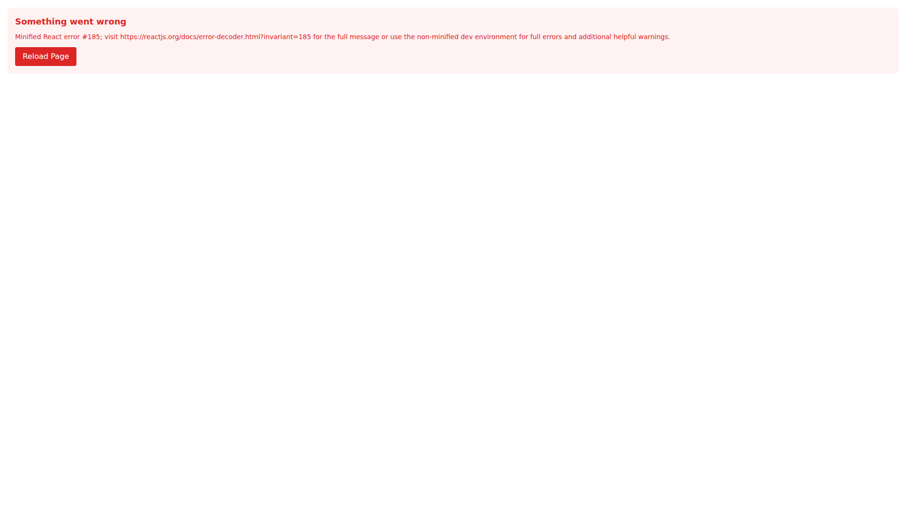

# Visual Documentation

**Generated:** 2025-05-29T15:30:56.336Z
**Commit:** `fc5c3ddc5f78a8ec4469dc5618547ede5be73805`
**Message:** feat: ✅ Phase 1.6 - Final cleanup and Phase 1 completion

LEGACY CLEANUP:
- Remove unused TimeSeriesData imports and state
- Clean up timeSeriesData fetch calls from Overview page
- Remove references to chart rendering functions
- Streamline fetchData function to dashboard data only

PHASE 1 COMPLETION SUMMARY:
✅ 1.1-1.3: Navigation reorganized with new page structure
✅ 1.4: Duplicate line charts removed, centralized in Trends Explorer
✅ 1.5: Shared components created (HeaderStatsBox, ExportButton, etc.)
✅ 1.6: Legacy props and unused code cleaned up

FOUNDATION ESTABLISHED:
- Clean 6-tab navigation: Overview → Trends → Product Insights → Customer → Basket → AI Recs
- Reusable component library for consistent UX
- Proper information architecture with reduced redundancy
- Ready for Phase 2 chart enhancements

🚀 PHASE 1 COMPLETE - Ready for advanced visualizations and AI features!

## 📱 Screenshots

### Dashboard Overview

Main dashboard with KPIs and transaction trends

Component Details

#### kpi metrics

### Consumer Insights

Demographics and behavior analysis

Component Details

#### kpi metrics

### Product Mix Analysis

Product performance and substitution patterns

### Trends Explorer

Advanced trend analysis with multiple metrics

Component Details

#### kpi metrics

---
*Generated by automated visual documentation system*
