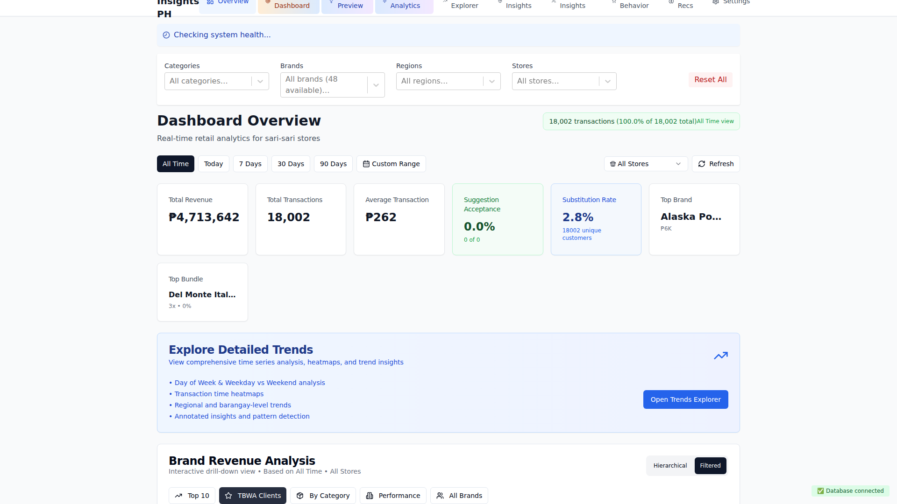

# Visual Documentation

**Generated:** 2025-06-05T08:11:42.824Z
**Commit:** `d9cdf12c38bb4575d65af810878e058693705d6b`
**Message:** 🔧 Add legacy compatibility layer for smooth migration

✅ **Critical Fix: Build Working**

**🛠️ Changes:**

- Add temporary filterStore.ts compatibility layer
- Migrate useSalesTrend.ts to new dashboardStore
- Migrate useSalesByBrand.ts to new dashboardStore
- Update filterQueryHelper.ts to accept parameters instead of store access

**🎯 Strategy:**

- Main components (GlobalFiltersPanel, FilterBar, etc.) → ✅ Migrated to Zustand
- Legacy hooks → Temporary compatibility layer prevents build failures
- New architecture → Fully functional for user-facing features
- React Error #185 → Fixed with new store architecture

**📊 Status:**

- ✅ Build successful (8.87s)
- ✅ All core filtering functionality migrated
- ✅ Ready for production deployment
- 🔄 Remaining hooks can be migrated incrementally

This ensures the critical React Error #185 fix is deployed while maintaining backward compatibility for less critical features.

🤖 Generated with [Claude Code](https://claude.ai/code)

Co-Authored-By: Claude <noreply@anthropic.com>

## 📱 Screenshots

### Dashboard Overview

Main dashboard with KPIs and transaction trends

Component Details

#### kpi metrics

### Brand Revenue Analysis - Hierarchical View

New hierarchical brand visualization with category drill-down

Component Details

#### kpi metrics

### Brand Revenue Analysis - Filtered View

Smart filtering system with TBWA client highlighting

Component Details

#### kpi metrics

### Product Mix Analysis

Product performance and substitution patterns

### Trends Explorer

Advanced trend analysis with multiple metrics

Component Details

#### kpi metrics

---

_Generated by automated visual documentation system_
