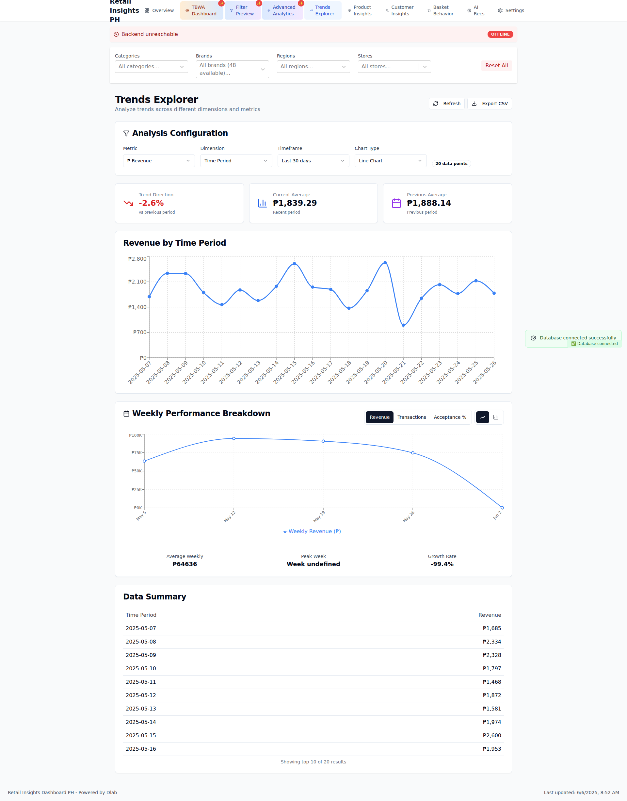
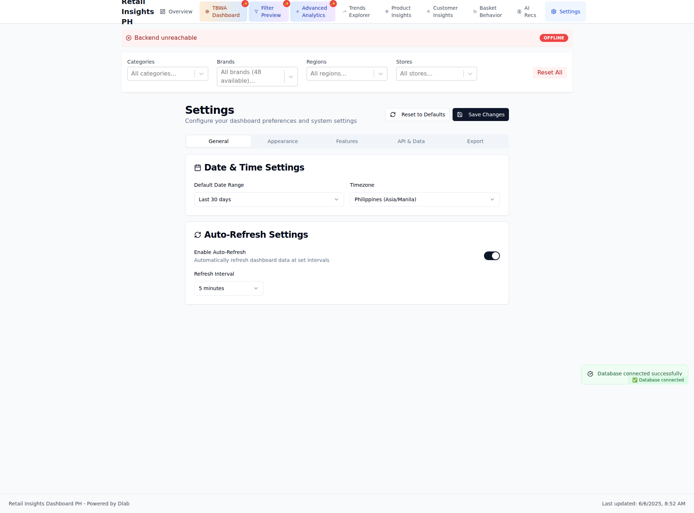

# Visual Documentation

**Generated:** 2025-06-06T00:53:47.100Z
**Commit:** `9c7be37a9192990c8ba62051e8045ed9bdbfee4d`
**Message:** 🔒 Implement MCP (Managed Connection Proxy) integration

- Added /pages/api/getMcpToken.js serverless endpoint
- Updated Supabase client with MCP support and fallback mechanism
- Created comprehensive MCP setup guide and test script
- Implements secure short-lived JWT tokens for enhanced security
- Automatic fallback to standard client if MCP fails
- Zero downtime deployment - existing functionality preserved

Benefits:
✅ Enhanced security with short-lived tokens
✅ Better connection pooling and performance
✅ Audit trail and monitoring capabilities
✅ Zero risk with automatic fallback mechanism

Setup: Configure VITE_SUPABASE_MCP_URL in Vercel to enable MCP

## 📱 Screenshots

### Dashboard Overview

Main dashboard with KPIs and transaction trends

Component Details

#### kpi metrics

### Trends Explorer

Advanced trend analysis with multiple metrics

Component Details

#### kpi metrics

### Settings Configuration

Dashboard settings and feature flags

Component Details

#### kpi metrics

---

_Generated by automated visual documentation system_
